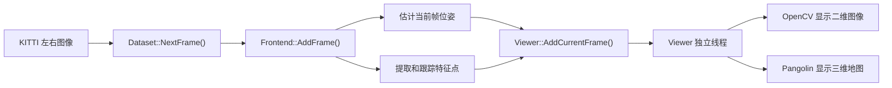

```mermaid
flowchart LR
    A["KITTI 左右图像"] --> B["Dataset::NextFrame()"]
    B --> C["Frontend::AddFrame()"]
    C --> D["估计当前帧位姿"]
    C --> E["提取和跟踪特征点"]
    D --> F["Viewer::AddCurrentFrame()"]
    E --> F
    F --> G["Viewer 独立线程"]
    G --> H["OpenCV 显示二维图像"]
    G --> I["Pangolin 显示三维地图"]
```

在相同窗口中放入不同帧来刷新可以较少线程