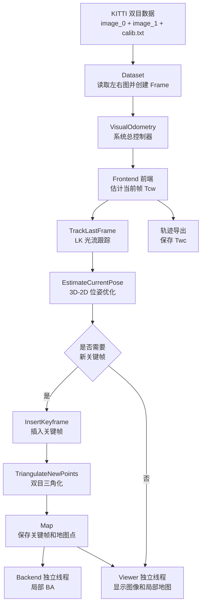

```mermaid
flowchart TD
    A["KITTI 双目数据<br/>image_0 + image_1 + calib.txt"]
    B["Dataset<br/>读取左右图并创建 Frame"]
    C["VisualOdometry<br/>系统总控制器"]
    D["Frontend 前端<br/>估计当前帧 Tcw"]
    E["TrackLastFrame<br/>LK 光流跟踪"]
    F["EstimateCurrentPose<br/>3D-2D 位姿优化"]
    G{"是否需要<br/>新关键帧"}
    H["InsertKeyframe<br/>插入关键帧"]
    I["TriangulateNewPoints<br/>双目三角化"]
    J["Map<br/>保存关键帧和地图点"]
    K["Backend 独立线程<br/>局部 BA"]
    L["Viewer 独立线程<br/>显示图像和局部地图"]
    M["轨迹导出<br/>保存 Twc"]

    A --> B
    B --> C
    C --> D
    D --> E
    E --> F
    F --> G
    G -- "是" --> H
    H --> I
    I --> J
    J --> K
    J --> L
    G -- "否" --> L
    D --> M
```
